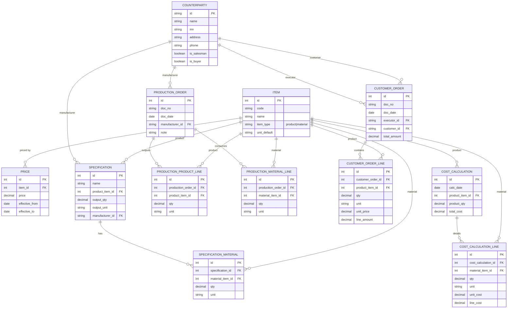

# Модуль 1. Проектирование ER-диаграммы

## 1. Теоретические основы

---

### 1.1. Понятие ER-моделирования

**ER-диаграмма (Entity–Relationship Diagram)** — это графическая модель данных, предназначенная для описания структуры базы данных на концептуальном и логическом уровнях.

ER-модель отражает:

* **сущности предметной области**;
* **атрибуты сущностей**;
* **связи между сущностями**;
* **кратности связей**;
* **ключи и ограничения целостности**.

ER-диаграммы используются:

* на этапе **проектирования информационных систем**;
* для согласования структуры данных с заказчиком;
* как основа для создания **реляционной базы данных**.

---

### 1.2. Предметная область и её анализ

**Предметная область** — это совокупность объектов, процессов и правил, которые существуют в реальной деятельности предприятия и подлежат автоматизации.

В рамках данного задания предметная область включает:

* производство продукции;
* использование материалов по спецификациям;
* расчёт себестоимости продукции;
* реализацию продукции заказчикам;
* оформление заказов и производственных документов.

Анализ предметной области выполняется на основе:

* документов заказчика;
* форм (заказ, спецификация, производство);
* справочников (контрагенты, номенклатура, цены).

---

### 1.3. Основные элементы ER-диаграммы

#### 1.3.1. Сущность (Entity)

**Сущность** — это объект предметной области, о котором необходимо хранить данные.

Примеры сущностей:

* Контрагент
* Номенклатура
* Спецификация
* Заказ покупателя
* Производство
* Расчёт стоимости

В ER-диаграмме сущность:

* изображается прямоугольником;
* соответствует **таблице** базы данных.

---

#### 1.3.2. Атрибут (Attribute)

**Атрибут** — это характеристика сущности.

Примеры:

* наименование;
* код;
* количество;
* цена;
* дата документа.

Атрибуты:

* должны быть **атомарными** (неделимыми);
* не должны содержать списков значений;
* описывают только **одну сущность**.

---

#### 1.3.3. Ключи

##### 1.3.3.1. Первичный ключ (Primary Key, PK)

* уникально идентифицирует запись в таблице;
* не может быть пустым (`NULL`);
* не должен изменяться.

Примеры:

* `id`
* `order_id`
* `item_id`

##### 1.3.3.2. Внешний ключ (Foreign Key, FK)

* ссылается на первичный ключ другой таблицы;
* обеспечивает **ссылочную целостность** данных.

Пример:

* `customer_id → Counterparty.id`

---

### 1.4. Связи между сущностями

#### 1.4.1. Типы связей

##### 1.4.1.1. Связь 1 : 1 (один к одному)

Редко используется, например:

* сущность и её расширенные характеристики.

##### 1.4.1.2. Связь 1 : M (один ко многим)

Наиболее распространённый тип:

* один заказчик → много заказов;
* один заказ → много строк заказа.

##### 1.4.1.3. Связь M : N (многие ко многим)

В реляционных БД **не реализуется напрямую**.
Требует создания **таблицы-связки**.

Пример:

* одна спецификация использует много материалов;
* один материал используется в разных спецификациях.

Решение:

* таблица `SpecificationMaterial`.

---

### 1.5. Таблица-связка (Junction Table)

**Таблица-связка** используется для реализации связи M:N и содержит:

* внешний ключ на первую сущность;
* внешний ключ на вторую сущность;
* дополнительные атрибуты связи (количество, роль, процент и т.п.).

Пример:

* `specification_id`
* `material_item_id`
* `qty`

---

### 1.6. Нормализация данных

**Нормализация** — процесс приведения структуры базы данных к формам, исключающим избыточность и аномалии обновления.

---

#### 1.6.1. Первая нормальная форма (1НФ)

Требования:

* отсутствуют повторяющиеся группы;
* все атрибуты атомарны.

Нарушение:

* хранение списка материалов в одном поле.

Решение:

* вынос материалов в отдельную таблицу.

---

#### 1.6.2. Вторая нормальная форма (2НФ)

Требования:

* все неключевые атрибуты зависят от **всего первичного ключа**.

Нарушение:

* атрибут зависит только от части составного ключа.

Решение:

* не использовать составные ключи, а только синтетические (простые).

---

#### 1.6.3. Третья нормальная форма (3НФ)

Требования:

* отсутствие транзитивных зависимостей;
* каждый неключевой атрибут зависит **только от PK**.

Нарушение:

* хранение цены материала одновременно в справочнике и в спецификации.

Решение:

* цена хранится отдельно (прайс или расчёт);
* документы используют ссылки и фиксируют значения только при необходимости (например, цена сделки).

---

### 1.7. Ссылочная целостность

**Ссылочная целостность** — это правило, согласно которому:

* каждая ссылка (FK) должна указывать на существующую запись (PK);
* нельзя удалить родительскую запись, если есть дочерние.

Реализуется через:

* внешние ключи;
* ограничения (`ON DELETE`, `ON UPDATE`).

---

### 1.8. Именование объектов БД

Для корректной и читаемой ER-модели необходимо:

* использовать **единый стиль именования**;
* избегать сокращений без необходимости;
* применять осмысленные имена.

Рекомендуемый стиль:

* таблицы — в множественном числе (`Items`, `CustomerOrders`);
* PK — `id`;
* FK — `<entity>_id`.

---

### 1.9. Документные и справочные сущности

#### 1.9.1. Справочники

Хранят относительно постоянные данные:

* Контрагенты
* Номенклатура
* Цены

#### 1.9.2. Документы

Фиксируют события и операции:

* Заказ покупателя
* Производство
* Расчёт стоимости

Документы обычно имеют:

* «шапку» (дата, номер, участники);
* табличную часть (строки документа).

---

### 1.10. ER-диаграмма как основа БД

ER-диаграмма:

* предшествует физическому проектированию;
* используется для создания SQL-схем;
* служит частью проектной документации по ГОСТ и ФГОС.

Корректно спроектированная ER-модель:

* соответствует 3НФ;
* легко масштабируется;
* предотвращает логические ошибки данных;
* упрощает сопровождение системы.

---

## 2. Методические указания (по документам заказчика)

---

### 2.1. Исходные данные для проектирования ER-модели

Проектирование ER-диаграммы выполняется **на основе документов заказчика**, отражающих реальную хозяйственную деятельность предприятия. Каждый документ анализируется с точки зрения выявления объектов предметной области, их атрибутов и взаимосвязей.

Цель анализа — определить, **какие сущности обязательно должны быть отражены в структуре базы данных**, и каким образом между ними должна быть обеспечена логическая и ссылочная целостность.

---

### 2.2. Анализ документов заказчика и выявление сущностей

#### 2.2.1. Справочник контрагентов (Заказчики.json)


Документ представляет собой справочник контрагентов предприятия. Для каждого контрагента зафиксированы:

* уникальный идентификатор (`id`) строкового типа (например, `000000001`);
* наименование (`name`);
* идентификационные и контактные данные (`inn`, `address`, `phone`);
* признаки ролей:

  * `salesman` — контрагент выступает поставщиком/исполнителем;
  * `buyer` — контрагент выступает покупателем.

Особенность документа: **один контрагент может совмещать несколько ролей**.

**Пример из файла Заказчики.json**

```json
[
	{
		"id": "000000001",
		"name": "ООО \"Поставка\"",
		"inn": "",
		"addres": "г.Пятигорск",
		"phone": "+79198634592",
		"salesman": true,
		"buyer": true
	},
	{
		"id": "000000002",
		"name": "ООО \"Кинотеатр Квант\"",
		"inn": "26320045123",
		"addres": "г. Железноводск, ул. Мира, 123",
		"phone": "+79884581555",
		"salesman": true,
		"buyer": false
	},
	{
		"id": "000000008",
		"name": "ООО \"Новый JDTO\"",
		"inn": "26320045111",
		"addres": "г. Железноводсу",
		"phone": "+79884581555",
		"salesman": true,
		"buyer": false
	},
	{
		"id": "000000003",
		"name": "ООО \"Ромашка\"",
		"inn": "4140784214",
		"addres": "г. Омск, ул. Строителей, 294",
		"phone": "+79882584546",
		"salesman": false,
		"buyer": true
	},
	{
		"id": "000000009",
		"name": "ООО \"Ипподром\"",
		"inn": "5874045632",
		"addres": "г. Уфа, ул. Набережная,  37",
		"phone": "+79627486389",
		"salesman": true,
		"buyer": true
	},
	{
		"id": "000000010",
		"name": "ООО \"Ассоль\"",
		"inn": "2629011278",
		"addres": "г. Калуга, ул. Пушкина, 94",
		"phone": "+79184572398",
		"salesman": false,
		"buyer": true
	}
]
```

👉 [Заказчики.json](../assets/files//Заказчики.json)

**Вывод для ER-модели:**
Необходимо создать сущность **Counterparty (Контрагент)** с ролями в виде логических атрибутов (без разделения на “Поставщики” и “Покупатели” в разные таблицы).


#### 2.2.2. Прайс-лист (Цены.xlsx)

Пример файла:

| Продукция / Материалы                 | Цена  |
|--------------------------------------|-------|
| Закваска сметанная                   | 45,00 |
| Кефир 2,5% 900г.                     | 80,00 |
| Кефир 3,2% 900г.                     | 82,00 |
| Молоко 2,5% 900г.                    | 70,00 |
| Молоко 3,2% 900г.                    | 76,00 |
| Молоко нормализованное               | 34,00 |
| Сметана классическая 15% 540г.       | 89,00 |
| Сметана классическая 20% 540г.       | 92,00 |


👉 [Цены.xlsx](../assets/files//Цены.xlsx)

Документ содержит перечень позиций с ценами. В одном списке присутствуют:

* готовая продукция;
* материалы.


Так как коды/наименования повторяются в других документах (спецификация, производство, заказ), хранение цены “по тексту” приведёт к дублированию.

**Вывод для ER-модели:**
Нужен единый справочник **Item (Номенклатура)**, в котором представлены **и материалы, и продукция**, а прайс (`Price`) должен ссылаться на номенклатуру через внешний ключ.


#### 2.2.3. Спецификация (Спецификация.xlsx)

Пример файла:

---

## Спецификация «Основная Сметана 15%»

**Продукция:** Сметана классическая 15% 540 г.

**Количество:** 1 шт.

**Изготовитель:** ООО Молочный комбинат «Полесье»

### Материалы


| Материалы                | Ед. изм. | Количество |
|--------------------------|----------|------------|
| Молоко нормализованное   | кг       | 0,900      |
| Закваска сметанная       | кг       | 0,070      |

---

### Примечание 

> Данная спецификация определяет нормативный состав продукции
> «Сметана классическая 15% 540 г.» при выпуске 1 единицы продукции.

 
👉 [Спецификация.xlsx](../assets/files//Спецификация.xlsx)

Документ «Спецификация» задаёт нормативный состав продукции и включает:

* продукцию (наименование);
* норму выхода (например, `1 шт.`);
* изготовителя;
* перечень материалов (материал, ед. изм., количество).

Связь спецификация ↔ материалы по смыслу является **M:N**.

**Вывод для ER-модели:**

* сущность **Specification**;
* таблица-связка **SpecificationMaterial**, содержащая количество материала (норму).

#### 2.2.4. Документ «Производство» (Производство.xlsx)

Пример файла:

---

## Производство № 1 от 9 июня 2025 г.

---

### Продукция

| № | Наименование продукции          | Код         | Кол-во | Ед. изм. |
| - | ------------------------------- | ----------- | ------ | -------- |
| 1 | Сметана классическая 15% 540 г. | НФ-00000006 | 1      | шт       |

---

### Материалы

| № | Наименование материала | Код         | Кол-во | Ед. изм. |
| - | ---------------------- | ----------- | ------ | -------- |
| 1 | Молоко нормализованное | НФ-00000004 | 0,90   | кг       |
| 2 | Закваска сметанная     | НФ-00000005 | 0,07   | кг       |

---

### Примечание

> Документ «Производство» фиксирует факт выпуска продукции и списания материалов
> в рамках одной производственной операции.


👉 [Производство.xlsx](../assets/files//Производство.xlsx)

Документ фиксирует производственную операцию и содержит два независимых блока:

1. выпуск продукции (код, наименование, количество, ед. изм.),
2. списание материалов (код, наименование, количество, ед. изм.).

Коды имеют единый формат (НФ-...), что подтверждает единую номенклатуру.

**Вывод для ER-модели:**

* сущность **ProductionOrder** (шапка);
* сущности табличных частей:

  * **ProductionProductLine** (выпуск продукции);
  * **ProductionMaterialLine** (списание материалов);
* строки ссылаются на `Item` через FK.

#### 2.2.5. Заказ покупателя (Заказ покупателя.xlsx)

Пример файла:

---

## Заказ покупателя № 2 от 6 июня 2025 г.

**Исполнитель:** ООО Молочный комбинат «Полесье»

**Заказчик:** ООО «Ассоль»

---

### Состав заказа

| № | Продукция          | Кол-во | Ед. изм. | Цена  | Сумма  |
| - | ------------------ | ------ | -------- | ----- | ------ |
| 1 | Кефир 2,5% 900 г.  | 12     | шт       | 80,00 | 960,00 |
| 2 | Кефир 3,2% 900 г.  | 9      | шт       | 82,00 | 738,00 |
| 3 | Молоко 2,5% 900 г. | 10     | шт       | 79,00 | 790,00 |

---

### Итого по заказу

**Общая сумма:** **2 488,00**

---

### Примечание (методически корректно)

> Цена продукции зафиксирована на момент оформления заказа
> и используется для расчёта итоговой суммы документа.


👉 [Заказ покупателя.xlsx](../assets/files//Заказ покупателя.xlsx)

Документ фиксирует реализацию:

* исполнитель (организация),
* заказчик (контрагент),
* строки: продукция, количество, цена, сумма,
* итоги.

Цена фиксируется **на момент оформления** и не должна “переписываться” при изменении прайса.

**Вывод для ER-модели:**

* сущность **CustomerOrder** (шапка) с FK на исполнителя и заказчика;
* сущность **CustomerOrderLine** (строки);
* `unit_price` хранится в строке (цена сделки).

#### 2.2.6. Расчёт стоимости продукции (Расчёт стоимости продукции.xlsx)


Пример файла:

 <table border="0" cellpadding="0" cellspacing="0" id="sheet0" class="sheet0 gridlines">
        <col class="col0">
        <col class="col1">
        <col class="col2">
        <col class="col3">
        <col class="col4">
        <tbody>
          <tr class="row0">
            <td class="column0 style15 s style15" colspan="4">Тип</td>
            <td class="column4 style16 s style17" rowspan="2">Стоимость</td>
          </tr>
          <tr class="row1">
            <td class="column0 style2 s">Продукция</td>
            <td class="column1 style2 s">Ед. изм.</td>
            <td class="column2 style2 s">Количество</td>
            <td class="column3 style2 s">Цена</td>
          </tr>
          <tr class="row2">
            <td class="column0 style18 s style18" colspan="4">Материалы</td>
            <td class="column4 style3 n">36.70</td>
          </tr>
          <tr class="row3">
            <td class="column0 style4 s">Сметана классическая 15% 540г.</td>
            <td class="column1 style5 s">шт</td>
            <td class="column2 style6 n">1.000</td>
            <td class="column3 style7 null"></td>
            <td class="column4 style8 n">36.70</td>
          </tr>
          <tr class="row4">
            <td class="column0 style9 s">Закваска сметанная</td>
            <td class="column1 style10 s">кг</td>
            <td class="column2 style11 n">0.070</td>
            <td class="column3 style12 n">10.00</td>
            <td class="column4 style13 n">0.70</td>
          </tr>
          <tr class="row5">
            <td class="column0 style9 s">Молоко нормализованное</td>
            <td class="column1 style10 s">кг</td>
            <td class="column2 style11 n">0.900</td>
            <td class="column3 style12 n">40.00</td>
            <td class="column4 style13 n">36.00</td>
          </tr>
          <tr class="row6">
            <td class="column0 style19 s style19" colspan="4">Итого</td>
            <td class="column4 style14 n">36.70</td>
          </tr>
        </tbody>
    </table>


👉 [Расчёт стоимости продукции.xlsx](../assets/files//Расчет стоимости продукции.xlsx)

Документ отражает калькуляцию себестоимости:

* материалы, количество,
* цена материала,
* стоимость строки,
* итоговая себестоимость.

**Вывод для ER-модели:**

* сущность **CostCalculation** (шапка расчёта);
* сущность **CostCalculationLine** (строки);
* строки обязательно ссылаются на материалы через FK на `Item`.

---

### 2.3. Принципы нормализации (3НФ) в данной модели

Для соответствия 3НФ применяются ключевые правила:

1. **Коды и наименования** продукции/материалов хранятся только в `Item`.
2. Документы содержат только **FK на справочники** и количественные атрибуты (qty, unit, суммы).
3. **Цены разделяются по назначению:**

   * справочная цена — в `Price`;
   * цена сделки — в `CustomerOrderLine.unit_price`;
   * цена материала в расчёте — в `CostCalculationLine.unit_cost` как значение расчёта.

Это устраняет дублирование и предотвращает аномалии обновления.

---

### 2.4. Формирование ER-модели

На основе анализа документов формируется ER-модель, включающая:

* справочники: `Counterparty`, `Item`, `Price`;
* документы: `Specification`, `ProductionOrder`, `CustomerOrder`, `CostCalculation`;
* табличные части документов;
* таблицу-связку для M:N (материалы в спецификации).

Каждая сущность:

* имеет PK;
* имеет FK (при наличии связей);
* логически обоснована предметной областью.


---

### 2.5. Готовая ER-диаграмма (Mermaid)


