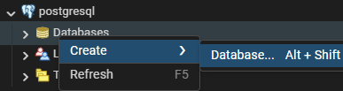
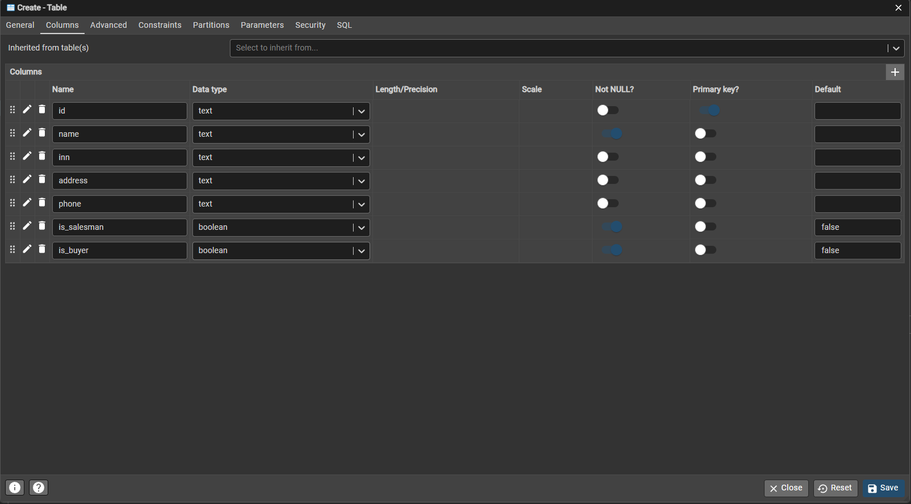
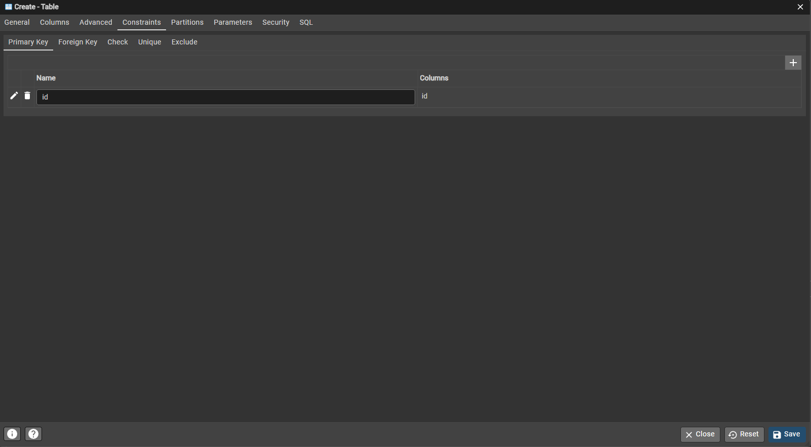

# Модуль 2. Разработка базы данных по ER-диаграмме (PostgreSQ через PgAdmin)

**Цель:** создать БД и таблицы по ER, настроить PK/FK/ограничения, затем импортировать `Заказчики.json`.

---

## 0. Важно перед стартом

* Везде ниже используется **один вариант выполнения**: **Конструктор (pgAdmin GUI)**

* Рекомендуемая структура: схема `app` (чтобы отделить от `public`).

---

## 1. Создание базы данных

 
1. Откройте **pgAdmin** → подключитесь к серверу.

   

   /// caption
   Рисунок 1 – Подключитесь к серверу
   ///

2. Правый клик по **Databases** → **Create → Database…**

3. `Database`: `dairy_demo` (или имя по заданию)

4. Owner: ваш пользователь (если доступно)

5. Save.

   

   /// caption
   Рисунок 2 – Создание БД
   ///

Подключение:

* pgAdmin: выбрать БД в дереве

---

## 2. Создание схемы (namespace) `app`


1. В дереве: **Schemas** → **Create → Schema…**

   

   /// caption
   Рисунок 3 – В дереве: **Schemas** → **Create → Schema…**
   ///

2. Name: `app`

3. Owner: ваш пользователь

4. Save.

   

   /// caption
   Рисунок 4 – app
   ///

---

## 3. Создание таблиц по ER-диаграмме (через GUI)

> Ниже перечислены основные сущности. Для каждой — описание через конструктор.

---

### 3.1. COUNTERPARTY (Контрагент)


1. **Schemas → app → Tables → Create → Table…**


    

    /// caption 
    Рисунок 5 – **Schemas → app → Tables → Create → Table…**
    ///


2. Name: `counterparty`

      

      /// caption
      Рисунок 6 – counterparty
      ///

3. Вкладка **Columns** → добавьте:

      

      /// caption
      Рисунок 7 – Вкладка **Columns**
      ///

   Создайте:

   * `id` type: `text`, **Primary Key**
   * `name` type: `text`, **Not null**
   * `inn` type: `text`
   * `address` type: `text`
   * `phone` type: `text`
   * `is_salesman` type: `boolean`, default: `false`, **Not null**
   * `is_buyer` type: `boolean`, default: `false`, **Not null**

     

     /// caption
     Рисунок 8 – Вкладка **Columns**
     ///

4. Вкладка **Constraints** → Primary Key на `id`

5. Save.

   

   /// caption
   Рисунок 9 – Вкладка **Constraints** → Primary Key на `id`
   ///

---

### 3.2. ITEM (Номенклатура)


1. Create → Table… Name: `item`

2. Columns:

      * `id` type: `bigserial`, **PK**
      * `code` type: `text`, Unique (см. Constraints)
      * `name` type: `text`, Not null
      * `item_type` type: `text`, Not null
      * `unit_default` type: `text`

3. Constraints:

      * Primary Key: `id`
      * Unique: `code`

4. Check constraint (вкладка Constraints → Check):

      * Name: `chk_item_type`
      * Expression: `item_type IN ('product','material')`

5. Save.

---

### 3.3. PRICE (Прайс-лист)


1. Create table `price`

2. Columns:

      * `id` bigserial PK
      * `item_id` bigint Not null
      * `price` numeric(12,2) Not null
      * `effective_from` date (optional)
      * `effective_to` date (optional)

3. Foreign Keys:

      * `item_id` → `app.item(id)`
      * On update: CASCADE
      * On delete: RESTRICT

4. Check constraints:

      * `price >= 0`
      * `effective_to IS NULL OR effective_from IS NULL OR effective_to >= effective_from`

5. Save.

---

### 3.4. SPECIFICATION и SPECIFICATION_MATERIAL

#### SPECIFICATION


1. Table `specification`

2. Columns:

      * `id` bigserial PK
      * `name` text Not null
      * `product_item_id` bigint Not null
      * `output_qty` numeric(12,3) Not null default 1
      * `output_unit` text
      * `manufacturer_id` text

3. FK:

      * `product_item_id` → `app.item(id)` (RESTRICT)
      * `manufacturer_id` → `app.counterparty(id)` (RESTRICT)

4. Check: `output_qty > 0`

5. Save.

#### SPECIFICATION_MATERIAL


1. Table `specification_material`

2. Columns:

      * `id` bigserial PK
      * `specification_id` bigint Not null
      * `material_item_id` bigint Not null
      * `qty` numeric(12,3) Not null
      * `unit` text

3. FK:

      * `specification_id` → `app.specification(id)` ON DELETE CASCADE
      * `material_item_id` → `app.item(id)` ON DELETE RESTRICT

4. Unique constraint:

      * `(specification_id, material_item_id)`

5. Check: `qty > 0`

6. Save.

---

### 3.5. PRODUCTION_ORDER, PRODUCTION_PRODUCT_LINE, PRODUCTION_MATERIAL_LINE


Создайте три таблицы по аналогии с предыдущими:

   * сначала `production_order` (PK),
   * затем `production_product_line` и `production_material_line` (FK на `production_order` и `item`),
   * обязательно выставьте `ON DELETE CASCADE` на строках документа.

---

### 3.6. CUSTOMER_ORDER и CUSTOMER_ORDER_LINE


   * `customer_order`: поля шапки + два FK на `counterparty`
   * `customer_order_line`: FK на `customer_order` (CASCADE) + FK на `item`

---

### 3.7. COST_CALCULATION и COST_CALCULATION_LINE


Аналогично: “шапка” + “строки”, на строках `ON DELETE CASCADE`.

---

## 4. Импорт `Заказчики.json`

### (через конструктор и инструменты pgAdmin)

На практике **pgAdmin не поддерживает прямой импорт JSON-файла сразу в колонки таблицы** (в отличие от CSV). Поэтому импорт выполняется **в два этапа**:

1. загрузка JSON целиком во временную (промежуточную) таблицу;
2. распаковка JSON и перенос данных в рабочую таблицу `counterparty`.

---

### 4.1. Создание промежуточной таблицы `counterparty_import`

1. В дереве pgAdmin откройте:

      **Schemas → app → Tables → Create → Table…**

2. Укажите параметры таблицы:

      * **Name:** `counterparty_import`
      * **Schema:** `app`

3. Перейдите на вкладку **Columns** и создайте колонку:

      * **Name:** `payload`
      * **Data type:** `jsonb`
      * **Not null:** ✔ (включено)

4. Сохраните таблицу (**Save**).

> Назначение таблицы `counterparty_import` — временно хранить **исходный JSON целиком**, без разборки по полям.

---

### 4.2. Загрузка содержимого файла `Заказчики.json` в таблицу

1. Откройте **Query Tool**:

     * правый клик по базе данных или схеме `app` → **Query Tool**

2. Откройте файл `Заказчики.json` в любом текстовом редакторе
   (например, Notepad++, VS Code).

3. **Выделите и скопируйте весь файл целиком**, включая:

      * квадратные скобки `[` `]`,
      * все объекты,
      * все запятые и кавычки.

4. В Query Tool выполните запрос вставки:

```sql
INSERT INTO app.counterparty_import ("payload ")
VALUES (
$$ '<вставьте содержимое JSON целиком>'$$::jsonb
);
```

Текст из Заказчики.json вставляем вместо: <вставьте содержимое JSON целиком>

5. Убедитесь, что запрос выполнился без ошибок
   (сообщение `INSERT 0 1` или аналогичное).

6. При необходимости проверьте, что данные загружены:

```sql
SELECT payload
FROM app.counterparty_import;
```

> На этом этапе **в таблице одна строка**, а в поле `payload` хранится **весь JSON-массив**.

---

### 4.3. Распаковка JSON и перенос данных в таблицу `counterparty`

Файл `Заказчики.json`, как правило, содержит **массив объектов**, например:

```json
[
  {
    "id": "C001",
    "name": "ООО Ромашка",
    "inn": "7701234567",
    "address": "г. Москва",
    "phone": "+7..."
  },
  ...
]
```

Чтобы превратить каждый объект массива в отдельную строку таблицы `counterparty`, используется функция `jsonb_array_elements`.

1. В **Query Tool** выполните запрос распаковки:

```sql
INSERT INTO app.counterparty (
    id,
    name,
    inn,
    address,
    phone,
    is_salesman,
    is_buyer
)
SELECT
    e->>'id'        AS id,
    e->>'name'      AS name,
    NULLIF(e->>'inn', '') AS inn,
    NULLIF(
        COALESCE(e->>'addres', e->>'address'),
        ''
    )               AS address,
    NULLIF(e->>'phone', '') AS phone,
    COALESCE((e->>'salesman')::BOOLEAN, FALSE) AS is_salesman,
    COALESCE((e->>'buyer')::BOOLEAN, FALSE)    AS is_buyer
FROM (
    SELECT jsonb_array_elements(payload) AS e
    FROM app.counterparty_import
) t;
```

2. Назначение основных операций:

      * `jsonb_array_elements(payload)` — разбивает JSON-массив на отдельные элементы;
      * `e->>'field'` — извлекает значение поля как текст;
      * `NULLIF(..., '')` — заменяет пустые строки на `NULL`;
      * `COALESCE(...)` — подставляет значение по умолчанию, если поле отсутствует;
      * приведение `::BOOLEAN` — корректно обрабатывает логические значения.

---

### 4.4. Проверка результата импорта

1. Убедитесь, что строки появились в основной таблице:

```sql
SELECT COUNT(*) 
FROM app.counterparty;
```

2. Просмотрите несколько записей:

```sql
SELECT *
FROM app.counterparty
ORDER BY id
LIMIT 10;
```

3. Также можно проверить данные через интерфейс pgAdmin:

   * правый клик по таблице `counterparty`
   * **View/Edit Data → All Rows**

---

### 4.5. Очистка промежуточной таблицы (по желанию)

После успешного импорта промежуточная таблица может быть:

* очищена:

```sql
TRUNCATE TABLE app.counterparty_import;
```

* или оставлена для повторных импортов / отладки.

---

### 4.6. Примечание

> Если файл `Заказчики.json` **очень большой**, рекомендуется использовать загрузку через `psql \copy`, так как она работает быстрее и надёжнее.
> Однако в рамках данного документа **рассмотрен только вариант через интерфейс pgAdmin и Query Tool**, без использования командной строки.

---

### 4.7. Практически без кода: импорт через CSV

*(pgAdmin Import/Export)*

pgAdmin поддерживает импорт данных **из CSV-файлов через графический интерфейс**, но **не поддерживает прямой импорт JSON**.
Поэтому наиболее простой и «безкодовочный» способ — **предварительно конвертировать JSON в CSV** и выполнить импорт стандартными средствами pgAdmin.

#### Шаги выполнения

1. Конвертируйте файл `Заказчики.json` в формат `Заказчики.csv`.

   Допускается использование:

   * Microsoft Excel (через Power Query);
   * LibreOffice Calc;
   * любого локального инструмента конвертации.

   В CSV-файле каждая строка должна соответствовать **одному заказчику**, а названия столбцов — полям таблицы `counterparty`.

2. В pgAdmin выполните импорт:

   * правый клик по таблице **`app.counterparty`**;
   * выберите **Import/Export Data…**;
   * вкладка **Import**;
   * укажите путь к файлу `Заказчики.csv`;
   * установите флаг **Header** (если первая строка содержит заголовки);
   * проверьте кодировку (обычно `UTF-8`);
   * при необходимости настройте разделитель (`;` или `,`);
   * подтвердите импорт (**OK**).

3. После завершения импорта проверьте результат:

```sql
SELECT COUNT(*)
FROM app.counterparty;
```

#### Преимущества способа

* минимальное использование SQL (фактически отсутствует);
* полностью графический интерфейс;
* устойчиво работает с большими объёмами данных.

#### Недостаток

* требуется предварительная конвертация файла JSON в CSV.

---

### 4.8. Минимум кода, но корректный импорт файла: PSQL Tool (`\copy`)

Данный способ сочетает **надёжность** и **минимальный объём команд**, но выполняется **через встроенный PSQL Tool pgAdmin**, а не через Query Tool.

#### Шаги выполнения

1. В pgAdmin откройте меню **Tools → PSQL Tool**.
2. В открывшемся терминале выполните команду:

```sql
\copy app.counterparty_import(payloadjsonb)
FROM 'C:/path/to/Заказчики.json'
WITH (FORMAT text);
```

> Путь к файлу указывается **на стороне клиента**, то есть на компьютере, где запущен pgAdmin.

3. После успешной загрузки выполните **распаковку JSON** в таблицу `counterparty`
   (используется запрос из пункта **4.3**).

#### Преимущества способа

* самый надёжный вариант для файлов JSON;
* корректно работает с большими файлами;
* минимальное количество SQL-кода.

#### Ограничение

* используется командный режим (`psql`), что может быть запрещено или ограничено в некоторых учебных средах.

---

## 5. Проверка своей базы данных

Для проверки свой БД после создания таблиц создайте ER-диагамму средствами Postgress для сравнения, что вы ничего не забыли. 

### 5.1. Выбрать БД

Нажимите на своей БД правой клавишей мыши. 

   

   /// caption
   Рисунок 10 – Проверка своей базы данных
   ///

### 5.2. Создание ER-диаграммы


   

   /// caption
   Рисунок 11 – Создание ER-диаграммы
   ///

### 5.3. Сохранение диаграммы

Диаграмму можно сохранить рядом с вашим ER, которые вы создали в начале экзамена с именем expodt_db.

   

   /// caption
   Рисунок 12 – Пример сохраненной диаграммы
   ///

## 6. Скачать пример готовой базы данных

- `dairy_demo.sql`

👉 [dairy_demo.sql](../assets/files//dairy_demo.sql)
 
